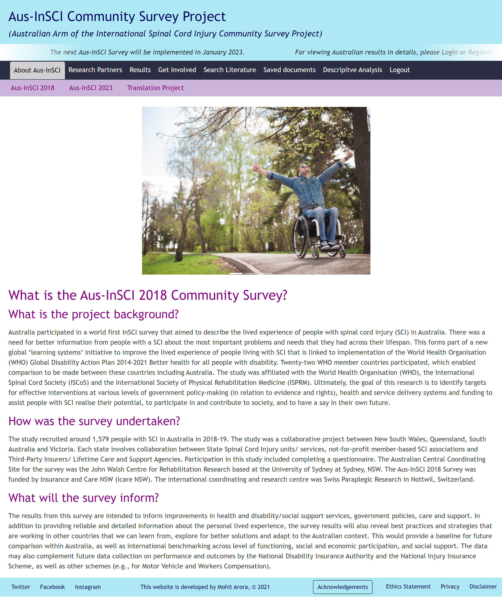
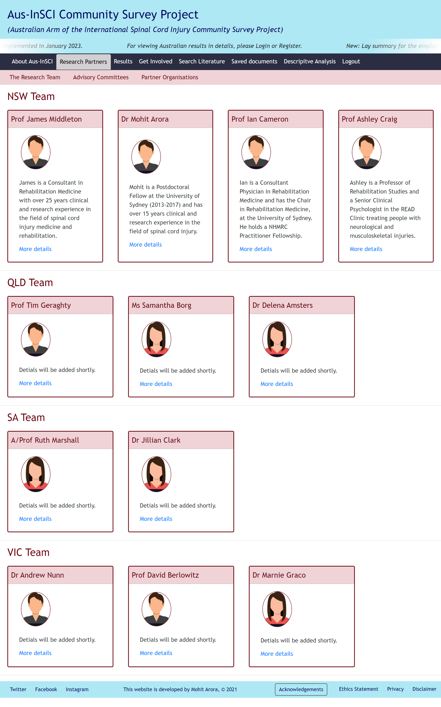
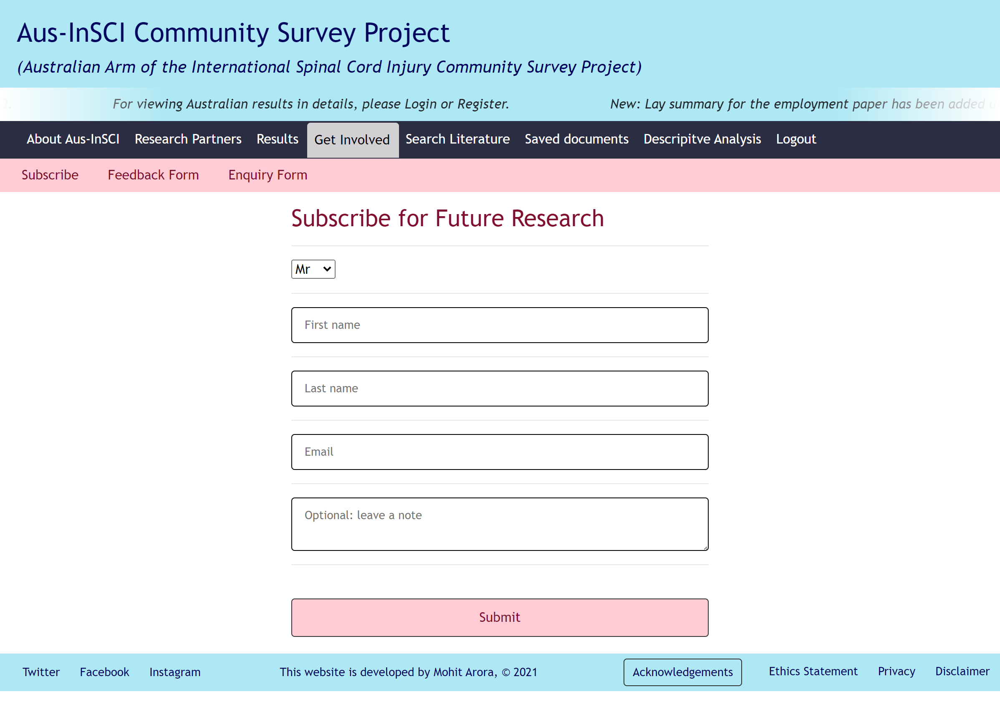

# <h1 align="center" style="color:yellow"> 🌍 Aus-InSCI Project 🌍</h1>
<h3 align="center"><i>Australian Arm of the International Spinal Cord Injury (Aus-InSCI) Community Survey Project</i></h3>
<br>

<p align="center">
    
    
    
    
</p>

<p align="center">
    
    
</p>
  
<p align="center">
    
    
    
    
    
    
    
    
    
    
       
</p>

## <span style="color:lightgreen">Description of the application</span>
```
A simple, polished, responsive and interactive application that allows consumers with spinal cord injury to access information and results of the Aus-InSCI community survey.
```

## <span style="color:lightgreen">Access deployed and repo link</span>

- [🎥 Aus-InSCI Project Website  🎥](https://aus-insci-project.herokuapp.com/)
- [👋 Aus-InSCI Project Repo 👋](https://github.com/marora7926/aus_insci_project)

Developed by [Mohit Arora](https://github.com/marora7926)

## <span style="color:lightgreen">Presentation link</span>
[👋 Aus-InSCI Project Presentation 👋](https://cloudstor.aarnet.edu.au/plus/s/iRYaw3oRDWDUBci)

## <span style="color:lightgreen">Table of contents</span>

  - [<span style="color:lightgreen">Description of the application</span>](#description-of-the-application)
  - [<span style="color:lightgreen">Access deployed and repo link</span>](#access-deployed-and-repo-link)
  - [<span style="color:lightgreen">Presentation link</span>](#presentation-link)
  - [<span style="color:lightgreen">Table of contents</span>](#table-of-contents)
  - [<span style="color:lightgreen">User story</span>](#user-story)
  - [<span style="color:lightgreen">Acceptance criteria</span>](#acceptance-criteria)
  - [<span style="color:lightgreen">Packages used</span>](#packages-used)
  - [<span style="color:lightgreen">Hooks used</span>](#hooks-used)
  - [<span style="color:lightgreen">Future developments</span>](#future-developments)
  - [<span style="color:lightgreen">Screenshot - Landing page</span>](#screenshot-landing-page)
  - [<span style="color:lightgreen">Screenshot - Partners page</span>](#screenshot-partners-page)
  - [<span style="color:lightgreen">Screenshot - Get Invovled page</span>](#screenshot-get-involved-page)
  - [<span style="color:lightgreen">App Developer</span>](#app-developer)

## <span style="color:lightgreen">User story</span>
``` 
AS AN Australian consumer with spinal cord injury or a stakeholder, 
I WANT TO access important results of the Aus-InSCI Community Survey that was undertaken in 2018 as well as ABLE to access all related information and published resources.  
```

## <span style="color:lightgreen">Acceptance criteria</span>
```
GIVEN the Aus-InSCI Project app
WHEN I load the Aus-InSCI app
THEN I am presented with a home page with Header, Navbars, Sub-component Navbars, Content and footer sections.

IN THE HEADER section, I am presented with the title of the app
EVERYTIME I click the title of the app in the header section, I land on the home page, irrespective of my location within the app.

IN THE NAVBAR section, I AM presented with a MARQUEE with latest news as well as six NAVTABS
WHEN I click on any NAVTAB, it gets in active more and AS A user, I am able to see this.

IN THE FOOTER section, I am presented with the project social media links as well as a link to download acknowledgements, ethics statement, privacy and disclaimer document.

WHEN I click the FIRST NAVTAB, which is about Aus-InSCI Project
THEN I presented with THREE Sub-components NAVTABS, namely Aus-InSCI 2018, Aus-InSCI 2023 and Translation Project
WHEN I click any of the Sub-components NAVTABS
I AM presented with information realed to Aus-InSCI 2018, Aus-InSCI 2023 and Translation Project, respectively 

WHEN I click the SECOND NAVTAB, which is about Reseach Partners,
THEN I presented with THREE Sub-components NAVTABS, namely Research Team, Advisory Committees and Partner Organisations.

  WHEN I click the Research Team Sub-components NAVTABS
  THEN I AM presented with a short portfolio for each member of the research team from the four participating Australian states

  WHEN I click the Advisory Commitees Sub-components NAVTABS
  THEN I AM presented with membership list of each of the working committees

  WHEN I click the Partner Organisation Sub-components NAVTABS
  THEN I AM presented with logo of each of the partner organisation in a MARQUEE

WHEN I click the THIRD NAVTAB, which is about Aus-InSCI Results
THEN I presented with THREE Sub-components NAVTABS, namely Plain Language Documents, National Report and Scientific Publications.

  WHEN I click the Plain Language Sub-components NAVTABS
  THEN I AM presented with link to access plain language result of the Aus-InSCI survey for consumers

  WHEN I click the National Report Sub-components NAVTABS
  THEN I AM presented with the summary as well as link to access the National Report

  WHEN I click the Scientific Publication Sub-components NAVTABS
  THEN I AM presented a list of published national and international articles as well as the link to access these
  
WHEN I click the FOURTH NAVTAB, which is about Get-Involved
THEN I presented with THREE Sub-components NAVTABS, namely
  Subscribe - for subcribing for future research
  Feedback Form - for provinding feedback on result or website, and 
  Enquiry Form - for contact the study centre for an general query

WHEN I click the FIFTH NAVTAB, which is about Search Literature using Web-API
THEN I am presented with an input field to search for literature and a submit button
WHEN I am not logged in and enter a search term in the input field and click the submit button
THEN I am presented with several search results, each featuring article’s title with link to it, author, journal name, year of publication, volume number, issue number and page number on google scholar website.

WHEN I click the SIXTH NAVTAB, which is Login/Register
THEN a modal appears on the screen with a toggle between the option to login or register

WHEN the toggle is set to REGISTER
THEN I am presented with three inputs for a username, an email address, and a password, and a signup button
WHEN I enter a valid email address and create a password and click on the signup button
THEN my user account is created and I am logged in to the site

WHEN the toggle is set to LOGIN
THEN I am presented with two inputs for an email address and a password and login button
WHEN I enter my account’s email address and password and click on the login button
THEN I the modal closes and I am logged in to the site

WHEN I am logged in to the site
THEN the I am presented with two additional NAVTABS, namely, Descriptive Data and Saved Literature as well as Login/Register NAVTAB change to Logout NAVTAB

WHEN I click the Descriptive Data Sub-components NAVTABS
THEN I AM presented with the summary and descriptive statistical analysis of the Australian Aus-InSCI survey data

WHEN I am logged in and enter a search term in the input field and click the submit button
THEN this time I will be presented with articles' details as well as a button to save my search to my account
WHEN I click on the Save button on a search article
THEN that article's information is saved to my account
WHEN I click on the option to see my saved Saved Literature
THEN I am presented with articles' details as well as a button to remove a book from my account
WHEN I click on the Remove Article on a article
THEN that article is deleted from my saved literature list

WHEN I click on the Logout button
THEN I am logged out of the site and land on the home page with Six NAVTABS
```

## <span style="color:lightgreen">Packages used</span>
  * [apollo/client](https://www.npmjs.com/package/@apollo/client) *- Apollo Client is a fully-featured caching GraphQL client with integrations for React, Angular, and more. It allows you to easily build UI components that fetch data via GraphQL.*
  * [apollo-server-express](https://www.npmjs.com/package/apollo-server-express) *-This is the Express integration of Apollo Server. Apollo Server is a community-maintained open-source GraphQL server that works with many Node.js HTTP server frameworks.*
  * [bcrypt](https://www.npmjs.com/package/bcrypt) *-A library to help you hash passwords.*
  * [bootstrap](https://getbootstrap.com/) *-Design and customize responsive mobile-first sites*
  * [compression](https://www.npmjs.com/package/compression) *- Compression in `Node.js` and `Express` decreases the downloadable amount of data that's served to users.*
  * [concurrently](https://www.npmjs.com/package/concurrently) *- Run multiple commands concurrently.*
  * [dotenv](https://www.npmjs.com/package/dotenv) *-Dotenv is a zero-dependency module that loads environment variables from a .env file into process.env*
  * [express](https://www.npmjs.com/package/express) *- Fast, unopinionated, minimalist web framework for `node`.*
  * [graphql](https://www.npmjs.com/package/graphql) *-The JavaScript reference implementation for GraphQL, a query language for APIs.*
  * [jsonwebtoken](https://www.npmjs.com/package/jsonwebtoken) *-JWT, or JSON Web Token, is an open standard used to share security information between two parties—a client and a server. Each JWT contains encoded JSON objects, including a set of claims.*
  * [jwt-decode](https://www.npmjs.com/package/jwt-decode) *-jwt-decode is a small browser library that helps decoding JWTs token which are Base64Url encoded.*
  * [lite-server](https://www.npmjs.com/package/lite-server) *- Lite-server is a lightweight development `server` that serves a web application, opens it in the browser, and refreshes the page when `HTML or JavaScript` changes are made to the source code.*
  * [@material-ui/core](https://www.npmjs.com/package/@material-ui/core) *-React components for faster and simpler web development. *
  * [mongoose](https://www.npmjs.com/package/mongoose) *- Mongoose is a MongoDB object modeling tool designed to work in an asynchronous environment. *
  * [nanoid](https://www.npmjs.com/package/nanoid) *- tiny, secure, URL-friendly, unique string ID generator for JavaScript.*
  * [react](https://www.npmjs.com/package/react) *-React is a JavaScript library for creating user interfaces.*
  * [react-bootstrap](https://www.npmjs.com/package/react-bootstrap) *-Bootstrap 4 components built with React.*
  * [react-bootstrap-table-next](https://www.npmjs.com/package/react-bootstrap-table-next) *-Next generation of react-bootstrap-table.*
  * [react-dom](https://www.npmjs.com/package/react-dom) *-This package serves as the entry point to the DOM and server renderers for React. It is intended to be paired with the generic React package, which is shipped as react to npm.*
  * [react-fast-marquee](https://www.npmjs.com/package/react-fast-marquee) *-React Fast Marquee is a lightweight React component that utilizes the power of CSS animations to create silky smooth marquees.*
  * [react-hook-form](https://www.npmjs.com/package/react-hook-form) *-React Hook Form will validate the input data against the schema and return with either errors or a valid result.*
  * [react-marquee-slider](https://www.npmjs.com/package/react-marquee-slider) *-Utilizes the power of CSS animations to create marquees.*
  * [react-router-dom](https://www.npmjs.com/package/react-router-dom) *-DOM bindings for React Router.*
  * [react-scripts](https://www.npmjs.com/package/react-scripts) *-This package includes scripts and configuration used by Create React App.*
  * [react-sizeme](https://www.npmjs.com/package/react-sizeme) *-Make your React Components aware of their width and/or height!*
  * [shield-io](https://shields.io/) *- for readme file.*
  * [styled-components](https://www.npmjs.com/package/styled-components) *-Styled Components help keep the concerns of styling and element architecture separated and make components more readable.*

## <span style="color:lightgreen">Hooks used</span>
  * [useEffect](https://reactjs.org/docs/hooks-effect.html) *- tell React that your component needs to do something after render.*
  * [useForm](https://react-hook-form.com/api/useform/) *-useForm is custom hook for managing forms with ease.*
  * [useLocation](https://reactrouter.com/web/api/Hooks/uselocation) *-The useLocation hook returns the location object that represents the current URL*
  * [useMutation](https://www.apollographql.com/docs/react/data/mutations/) *-The useMutation React hook is the primary API for executing mutations in an Apollo application.*  
  * [useQuery](https://www.apollographql.com/docs/react/data/queries/) *-The useQuery React hook is the primary API for executing queries in an Apollo application*  
  * [useState](https://www.npmjs.com/package/usestate) *-usestate gives the webcomponents a new life cycle.*


## <span style="color:lightgreen">Future developments</span>
  1. Collect data from forms and save to mongoose DB atlas
  2. Fetch data from Google Scholar or PubMed API in the search literature section. 
  3. Use inquirer to enter new data from the back end (e.g., dynamically adding new published articles to the page).
  4. Implement a gateway for processing payments in future (e.g., for fundraising)
  5. Global CSS styling and branding.
  6. Improve features and functionality by undertaking a consumer focus group discussion and understand their needs and build further insight. 

## <span style="color:lightgreen">Screenshot Landing page</span>


## <span style="color:lightgreen">Screenshot Research Partners page</span>


## <span style="color:lightgreen">Screenshot Get Involved page</span>


## <span style="color:lightgreen">App Developer</span>
```
Mohit ARORA
Email: mohitcoder2021@gmail.com
GitHub: https://github.com/marora7926
LinkedIn: https://www.linkedin.com/in/mohit-arora-098750122/
```
- - -
© 2021 Bootcamp students. Confidential and Proprietary. All Rights Reserved